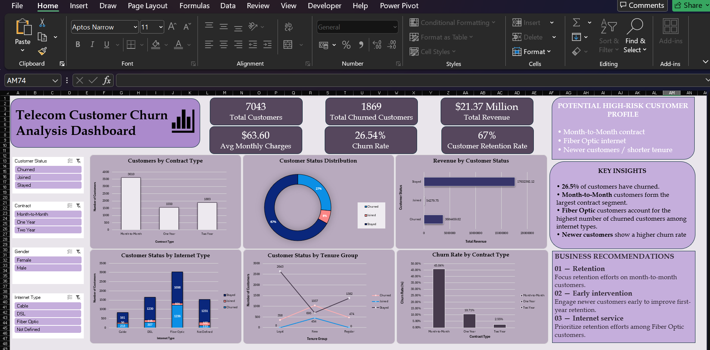

# Telecom Customer Churn Analysis Dashboard
A Microsoft Excel dashboard built as a self-practice project to analyze customer churn patterns for a telecom company.

## 📊 About the Project
This project explores customer churn data to identify key patterns and factors that influence whether a customer stays or leaves. It was built to practice Excel dashboarding skills — including pivot tables, charts, slicers, and data visualization techniques.

## 🎯 Objectives
- Analyze customer demographics, services, and account information
- Identify key drivers behind customer churn
- Visualize churn trends through an interactive Excel dashboard
- Practice data cleaning, pivot tables, and dashboard design in Excel

## 🗂️ Dataset
- **Source:** [Maven Analytics Data Playground – Telecom Customer Churn](https://mavenanalytics.io/data-playground/telecom-customer-churn)
- **Description:** Customer records for a fictional telecom company providing phone and internet services to over 7,000 customers in California — includes customer demographics, location, account details, subscribed services, and churn status.

## 🛠️ Tools Used
- Microsoft Excel (Pivot Tables, Pivot Charts, Slicers, Conditional Formatting)

## 📈 Dashboard Preview

🎥 A short video walkthrough of the dashboard is also included: [`TelecomChurn.mp4`](TelecomChurn.mp4)

## 🔍 Key Insights
- Overall churn rate stands at **26.5%** of total customers.
- **Month-to-Month** contracts form the largest customer segment, making them a key focus area for retention.
- Among internet service types, **Fiber Optic** customers account for the highest number of churned customers.
- **Newer customers** (shorter tenure) show a noticeably higher churn rate compared to long-tenure customers.

## 📁 Files in this Repository
| File | Description |
|------|--------------|
| `Telecom_Churn_Dashboard.xlsx` | The main Excel dashboard file |
| `Dashboard.png` | Screenshot preview of the dashboard |
| `TelecomChurn.mp4` | Video walkthrough of the dashboard |

## 🙋‍♀️ About
This was a personal practice project to strengthen my Excel and data analysis skills. Feedback and suggestions are welcome!
